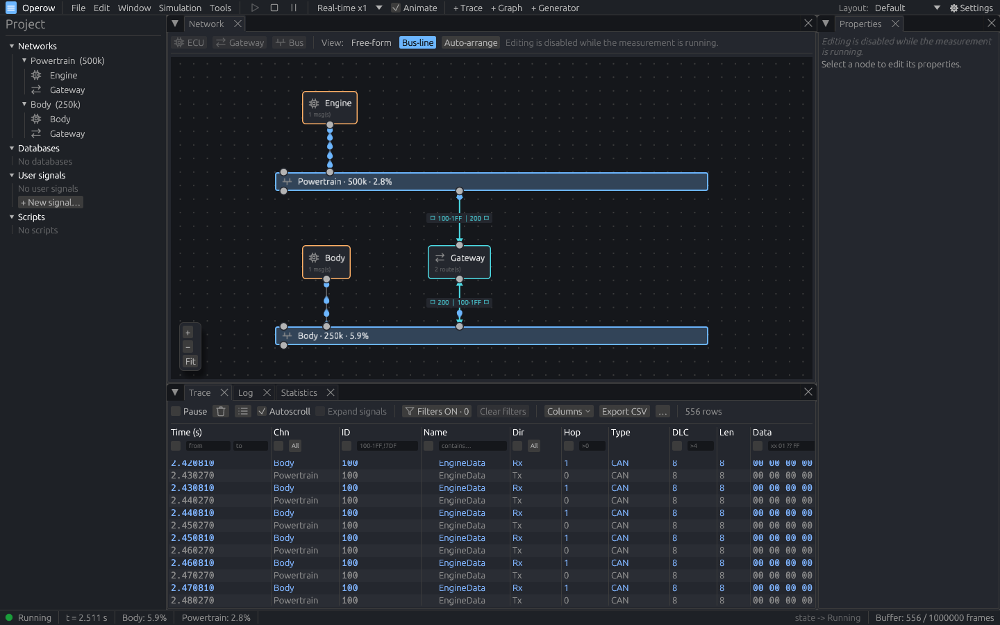
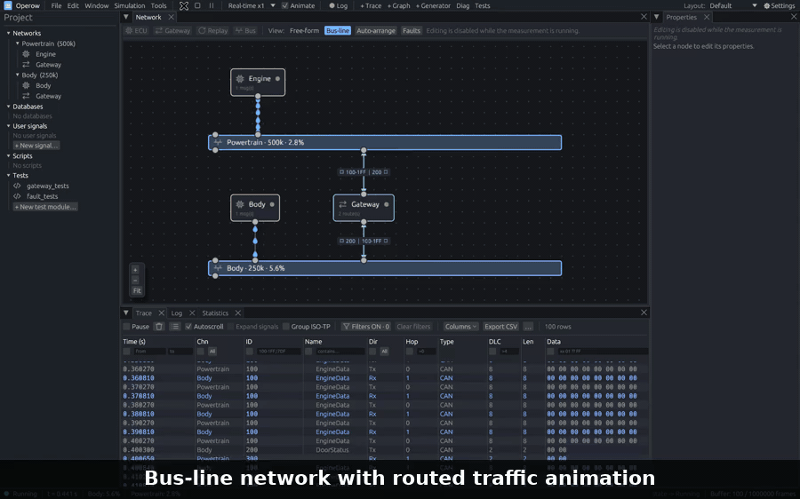

# Operow

A CANoe-inspired ECU network simulator for automotive CAN / CAN FD design and testing, written in Rust with a native egui UI and an in-process deterministic simulation engine.

[](https://github.com/niketdhale/Operow/actions/workflows/ci.yml)
[](https://github.com/niketdhale/Operow/actions/workflows/release-windows.yml)
[](LICENSE)
[](Cargo.toml)
[](https://github.com/emilk/egui)
[](#build--run)



## Feature tour



## Features

### Network & simulation

- Multiple buses per project, with CAN 2.0 and CAN FD frames
- Gateways with routing, ID remapping and delay between buses
- Send types: Cyclic, Event, OnChange, CyclicIfActive and CyclicAndEvent
- Rhai scripting (CAPL-like) for ECU behavior, with a live log
- Interactive generators for raw and DBC-decoded frames
- Deterministic, event-driven timing

### Analysis

- Multiple trace windows, in chronological or fixed-position mode
- Per-column filters with a global on/off toggle
- Tx/Rx direction shown from the bus point of view
- DBC decoding of frames and signals
- Live graphs of DBC, user and raw signals
- Bus statistics and CSV export

### Workspace

- Docked windows and a project tree
- Window layouts saved inside the project
- Bus-line and free-form network views
- Undo / redo
- Settings, including the frame buffer size (1M frames by default)

### Databases

- DBC import, referenced by path
- User-defined signals

## Download

Windows x64 builds come from the "Release (Windows)" workflow. Pushes to `develop` publish a zip as an Actions artifact (`operow-windows-x64`, kept 30 days; open the workflow run under the Actions tab). Tags matching `v*` also create a GitHub Release with the zip attached, found under Releases. The zip contains `operow.exe`, `examples/`, `README.md` and `LICENSE`.

## Build & Run

### Linux

```bash
sudo apt-get install libxkbcommon-dev libgtk-3-dev libxcb-render0-dev libxcb-shape0-dev libxcb-xfixes0-dev libgl1-mesa-dev
cargo run -p operow-app --release
```

### macOS & Windows

```bash
cargo run -p operow-app --release
```

## Examples

Open them with File > Open.

- `examples/basic.operow.json`: 3 ECUs (Engine, Brake, Gateway) on one 500 kbit/s CAN bus, about 180 frames/s at 4% bus load
- `examples/gateway.operow.json`: Powertrain and Body buses joined by a routing gateway
- `examples/dbc_demo.operow.json`: DBC-decoded traffic using `examples/sample.dbc`
- `examples/script.operow.json`: Requester and Responder ECUs driven by Rhai scripts

## Testing

```bash
cargo test --workspace
cargo test -p operow-engine --test example_smoke
```

## Architecture

The workspace consists of the following crates:

- **operow-core**: Data types and CAN / CAN FD frame definitions
- **operow-engine**: Discrete-event simulation engine
- **operow-dbc**: DBC parser and signal decoding
- **operow-isotp**: Sans-IO ISO 15765-2 (ISO-TP) transport state machine, independent of the engine
- **operow-app**: Native egui frontend. The node-graph canvas comes from [`egui-flow`](https://github.com/niketdhale/egui-flow), a separate React Flow-style widget crate pulled in as a git dependency

## Roadmap

- Logging & replay
- Error simulation & node controls
- ISO-TP / UDS
- Test sequences & headless CLI
- Hardware: SocketCAN / PCAN / Vector
- Ethernet / SOME-IP

## License

MIT, see [LICENSE](LICENSE).
